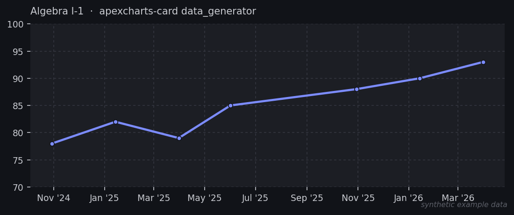
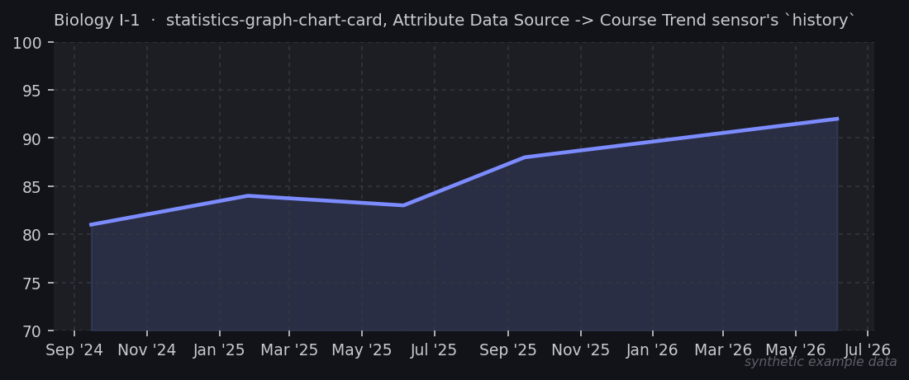

# PowerSchool Grades & Attendance for Home Assistant

A custom Home Assistant integration that pulls per-course grades, attendance,
and GPA out of a district's PowerSchool **guardian portal** and exposes them
as sensors. There is no public API for parent/guardian accounts, so this
works by logging in and parsing the same HTML pages your browser loads --
it is a scraper, not a client for an official PowerSchool API.

Built and verified against a live district instance (East Noble, IN) on
2026-09-06/09-07, against two students on two different grading schemes (a
high schooler on semesters, an elementary student on marking periods).
Other districts run the same PowerSchool SIS software but can be on
different versions or have different template customizations -- see
"When it breaks" below.

## What it gives you

- One Home Assistant "device" per linked student (multi-student guardian
  accounts are handled automatically via the portal's student switcher).
- A GPA sensor per student, when the portal publishes one.
- A sensor per course row on the grades/attendance table. State is the most
  recently populated grading period's grade -- works whether the district
  grades on 2 semesters or 4 marking periods, since the number of periods
  isn't hardcoded. Attributes include teacher name, every grading period's
  grade (not just the current one), absences, and tardies.
- An Attendance sensor per student: state is total absences across every
  current class, with total tardies and a per-course breakdown as
  attributes. (This rolls up the same per-course totals already on the
  grades table -- it does not scrape the separate day-by-day Attendance
  History page, which is a much bigger year-long per-period grid of
  attendance codes. Good v2 if you want that level of detail.)
- A Missing Assignments sensor per student: state is the count of currently
  missing assignments, with the full list (course, due date, assignment
  name, category, teacher) as an attribute.
- A Missing Assignments **to-do list** per student (needs Home Assistant
  2024.2+), mirroring the same data as an actual to-do list entity instead
  of a sensor attribute -- drop a native "To-do List" card on it and get a
  readable, sortable-by-due-date list with no templating required. It's
  read-only on purpose: this list is recomputed from PowerSchool on every
  poll, so there's nothing sensible for "check off" or "delete" to do --
  neither is offered, and the list just reflects whatever the portal says
  is currently missing.
- A Grade History sensor per student, covering every *completed* school
  year PowerSchool has archived -- not the current year, which is what the
  course sensors above are for. State is the count of years on file;
  attributes carry the full year -> term -> course breakdown plus a
  flattened, chronologically-ordered list meant for charting. See "Grade
  History" below for the data shape and an example chart config.
- Optional, opt-in Course Trend sensors -- one per (student, course name)
  you list in the integration's options, each already filtered to just
  that course's history. These exist for chart cards that can't filter an
  attribute array themselves (see "Course Trend sensors" below); most
  people charting one course can skip this and use apexcharts-card's
  data_generator against the Grade History sensor directly instead.

## Installation

1. Copy `custom_components/powerschool_grades/` into your Home Assistant
   config directory, so you end up with
   `<config>/custom_components/powerschool_grades/`.
2. Restart Home Assistant.
3. Settings -> Devices & Services -> Add Integration -> "PowerSchool Grades
   & Attendance".
4. Enter the portal host **without** `https://` (e.g.
   `powerschool.eastnoble.net`), and your guardian username/password. The
   config flow logs in for real before saving, so a typo or bad password
   fails immediately instead of silently.

Poll interval defaults to 45 minutes; change it from the integration's
"Configure" options after setup. There's no published rate limit for the
guardian portal, so this stays conservative on purpose -- grades and
attendance don't need minute-level freshness, and hammering a school's login
endpoint is a good way to get an account flagged or locked.

## How the login actually works

`custom_components/powerschool_grades/api.py` has the details, but in short:

- `GET /public/` to get a session cookie and the login form's hidden fields.
- `POST` the form back to `/guardian/home.html` with `account`/`pw` set to
  your credentials, and `dbpw`/`ldappassword` mirroring `pw` in plaintext
  (over HTTPS) -- that's what this district's own
  `/admin/javascript/signin-script.js` does client-side (its
  `encryptGuardianPassword()` etc. are no-op stubs in this build).
- Older PowerSchool deployments may still RC4-encrypt the password using
  `md5(contextData)` as the key before submitting it, instead of sending it
  plain. If login silently fails against a different district, fetch that
  district's `signin-script.js` unauthenticated and check whether
  `encryptGuardianPassword` is still a real function -- that tells you which
  scheme to implement.
- Multi-student accounts switch the "active student" in the session with a
  `POST /guardian/home.html` carrying `selected_student_id=<id>`; student
  IDs and names come from `switchStudent(<id>)` links in the page.
- The grades/attendance table is found by its `<caption>` text
  ("Attendance By Class"). Column count is *not* fixed -- the number of
  grading-period columns depends on the student's grading scheme (2 for
  semesters, 4 for marking periods, seen so far), read from the header
  row's Course/Absences column labels rather than assumed. The row layout
  is 11 attendance-grid cells (one per school day in the last/this-week
  columns), then course+teacher, then N grading-period cells, then
  absences, then tardies. The course cell is located by *content* (the
  first `<td>` containing an "Email teacher" link or a "Details about
  teacher" title) rather than a fixed index, as a safeguard against the
  attendance-grid cell count varying by class schedule; everything else
  (grades, absences, tardies) is then read relative to wherever the
  course cell actually is.
- A grade cell for a period with nothing gradable yet isn't just empty --
  it renders a placeholder, and there's more than one kind: a lone "info"
  glyph (`[ i ]`) for "not graded this period yet", or the literal text
  "Not available" for a period that hasn't started at all (e.g. semester 2
  before semester 2 begins). Both are treated as "no grade" (see
  `NOT_YET_GRADED_RE` in api.py) rather than as real grade text -- a course
  sensor's state should always be an actual grade or nothing, never a
  portal placeholder string. If a course sensor's state ever shows some
  other odd placeholder instead of a grade, this regex is the first thing
  to extend.
- Missing assignments come from `/guardian/missingasmts.html`, matched by
  its header row (`Course | Due Date | Assignment | Category | Teacher`)
  rather than a CSS class, since PowerSchool reuses generic `table.grid`
  classing all over the portal.
- The client logs in once and reuses the session across polls (an aiohttp
  cookie jar), rather than re-logging in every 15-45+ minute refresh. If
  the portal's own session cookie expires faster than that -- observed in
  practice: after a while, every authenticated page silently comes back as
  the sign-in page again, no error, no redirect -- every fetch checks for
  that (`_looks_signed_out()` in `api.py`) and transparently re-logs in and
  retries once before giving up. Without this, a dead session doesn't fail
  loudly: it just looks like "no students found," which then looks like
  "no classes found," which shows up in HA as every sensor going stuck on
  `unknown` -- confusing, since it's not an `UpdateFailed`/unavailable
  state, just stale data forever until the integration reloads.

## Grade History

Completed school years live on a separate page from the current year's
grades (`/guardian/termgrades.html`, vs. `/guardian/home.html` for the
in-progress term), and PowerSchool only lists a year there once it's
closed out -- there's no way to get the current year's data from this
page. Each year is its own tab on that page, e.g. `25-26 - RC` or
`20-21 - AV`: a school-year range, a dash, then a short code for whichever
school the student attended that year, which can change year to year (a
student who moved from an elementary school to a middle school has a
different code, and a different `schoolid`, for the years at each). Tabs
are found by matching that text pattern rather than assuming specific
codes -- `RC`, `MS`, `AV`, and `HS` have all shown up on one account. Each
tab's `termid`/`schoolid` pair is pulled from its link and fetched
separately.

A year's table has no fixed number of terms or column count -- a
`<th colspan="5">` row starting a new term section (labeled `S1`/`S2`,
`H1`, `M1`-`M4`, `T1`-`T3`, depending on the district's and school's own
grading scheme) alternates with that term's course rows (Course, Grade, %,
Citizenship, Hours). Citizenship is often blank at the elementary level.

This is a lot more data than the rest of the integration pulls per poll,
and none of it changes once a year is archived, so it's on its own
24-hour refresh cycle with its own login session, independent of the
regular scan interval setting. A brand-new install's Grade History
sensors will read 0 / empty attributes until that first background
refresh completes.

`course_percent_history` (a Grade History sensor's attribute) is a flat
list of `{year, term, course, grade, percent, date}` rows, oldest first.
`date` is an estimate, not a real grading-period end date -- PowerSchool
doesn't expose one here, so each term is placed at an even spacing across
an assumed Aug 15 - Jun 15 school year, which is enough to get the terms
in the right order and season for a trend line. An
[apexcharts-card](https://github.com/RomRider/apexcharts-card) (HACS)
series for one course looks like:

```yaml
type: custom:apexcharts-card
graph_span: 6y
series:
  - entity: sensor.sam_rivera_grade_history
    name: Algebra I
    data_generator: |
      return entity.attributes.course_percent_history
        .filter(row => row.course === "Algebra I-1")
        .map(row => [new Date(row.date).getTime(), row.percent]);
```



(`sam_rivera` above is a placeholder -- swap in whichever Grade History
entity `Settings -> Devices & Services -> Entities` shows for your own
student, and the numbers in the chart are made up for illustration, not
anyone's real grades.)

### Course Trend sensors (for chart cards that can't filter an attribute)

apexcharts-card's `data_generator` above runs real JavaScript against
`course_percent_history`, so it can filter to one course itself. Not every
chart card can do that -- [statistics-graph-chart-card](https://github.com/cataseven/Statistics-Graph-Chart-Card),
for one, has an "Attribute Data Source" mode built for exactly this shape
of data (an array of `{time, value}`-ish objects on an attribute), but its
Value Expression field is arithmetic-only: it can transform a row's own
fields, but it cannot filter the array down to a subset (no property
comparison, no JS) -- confirmed against its own Advanced-tab tooltips,
which say as much. Pointed straight at `course_percent_history`, it has no
way to show just one course; it would plot every course's grades as one
mixed line.

For cards like that, turn on a per-course sensor instead of asking the
card to filter: Settings -> Devices & Services -> PowerSchool Grades &
Attendance -> Configure, and fill in **Course trend sensors** with a
comma-separated list of exact course names (same spelling
`course_percent_history` uses, e.g. `Algebra I-1, Biology I-1` -- check an
existing Grade History sensor's attributes if you're not sure of the
exact string). Saving reloads the integration and adds one sensor per
(student, course name) -- e.g. `sensor.sam_rivera_biology_i_1_trend`
-- with the filtering already done: state is the most recent percent on
file, and a `history` attribute holds just that course's rows across every
completed year, in the same `{year, term, grade, percent, date}` shape as
`course_percent_history`'s rows.

This is deliberately opt-in and per-course rather than automatic for every
course on the account -- an entity per course per student, unprompted,
would be clutter for anyone not charting per-course trends at all. Point
statistics-graph-chart-card's `data_attribute` at `history`,
`data_time_field` at `date`, `data_value_field` at `percent`:

```yaml
type: custom:statistics-graph-chart-card
entities:
  - entity: sensor.sam_rivera_biology_i_1_trend
    name: Biology I-1
    color: "#7c8cff"
    data_attribute: history
    data_time_field: date
    data_value_field: percent
    data_time_unit: iso
```



(Again, `sam_rivera` and the numbers plotted are a made-up placeholder,
not a real student's data -- point `entity:` at your own Course Trend
sensor's entity ID.)

## When it breaks

This is HTML scraping against a UI PowerSchool and individual districts can
change without notice -- a PowerSchool SIS version bump, a district
switching to the newer Angular-based portal UI, or even a template tweak
can all break parsing silently (you'll see `UpdateFailed` / stale sensors,
not a clean error). Treat this as "needs occasional maintenance," not
"install and forget."

## Legal/ToS note

You're scraping your own guardian account's data, which is materially
different from scraping someone else's -- but PowerSchool's and/or your
district's terms of service may still have language against automated
access. Worth a skim before you rely on this, and worth keeping the poll
interval modest so it doesn't look like abuse.

## Ideas for v2 (not implemented here)

- Day-by-day attendance codes from the Attendance History page (present vs.
  a specific code like unexcused/tardy-excused/etc, per period, per day) --
  currently only totals are exposed, via the Attendance sensor above.
- Per-assignment detail via the `scores.html?frn=...&fg=S1` links already
  present on each grade cell, for a "new grade posted" binary_sensor to
  drive a notification automation.
- Config-flow validation of the *host* itself (right now a bad hostname just
  surfaces as `cannot_connect`, which is accurate but not very specific).
